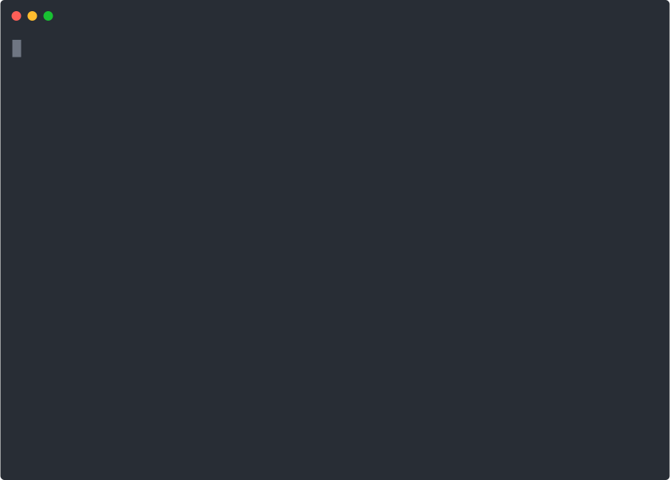

# Create Rubik App 

<p align='center'>

</p>

## Init and select type delay
```
$ yarn create rubik-app my-app
```
## Init with some type
Supported type now: `library|pure|react|vue|electron|ant-design-pro-vue`
```
$ yarn create rubik-app my-app --type react // init with react
```

## Init with directly git repo
```
$ yarn create rubik-app my-app --repo git@xxx/xxx.git
```

